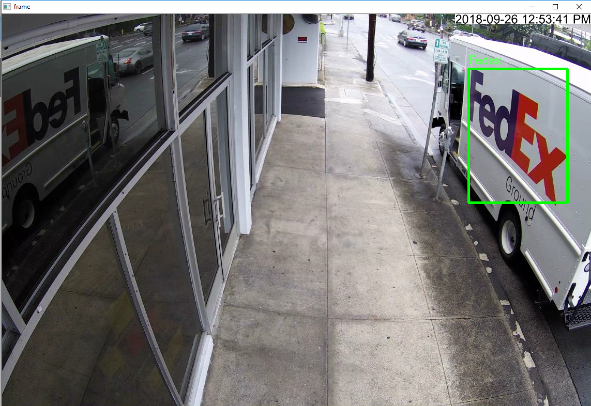
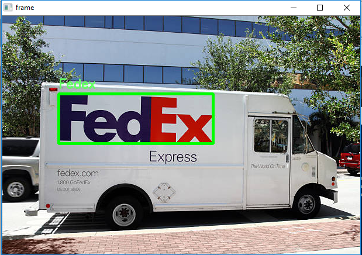

# openCV-Fedex-Detector

IP Camera OpenCV Fedex detector. Uses raw OpenCV, no deep learning or trained neural networks. Mainly uses color thresholding and contour detection. 
## Example Detection
IP Camera Frame




## Dependencies
```
pip install python-opencv
pip install numpy
pip install playsound
pip install imutils
```

## Overall Algorithm 
```
Get camera IP address
Initialize IP camera stream, color thresholds, start subprocess camera frame grabber
While camera is open
    Grab frame
    Find bounding box for purple
    Find bounding box for red/orange
    If both bounding boxes are valid
        If boxes are adjacent relative to their proximity 
            If contours pass false positive checks
                Combine bounding boxes
                Write bounding box on original frame
                Play sound notificaiton
                Save image on disk
        Else show original frame
    Else show original frame
```

## Bounding Box Algorithm
```
Transform BGR lower and upper color thresholds into np.arrays
Gaussian blur the frame
Create a kernel 2D matrix
Use kernel to erode frame
Use kernel to dilate frame
Convert BGR to HSV
Create a mask
Find all contours in the mask
Find largest contour and obtain bounding rectangle coordinates
Return x,y,w,h,cX,cY,and largest contour
```

## Example Usage
### fedex_detector.py
Script to capture real-time IP camera frames and detect Fedex using OpenCV color thresholding and contour detection.
```
python fedex_detector.py -s <ip_camera #>
```

## Utility Scripts
### fedex_single_detector.py
Script to detect Fedex with a given image from disk using OpenCV color thresholding and contour detection.
```
python fedex_single_detector.py 
```

### gimptoHSV.py
Convert Gimp HSV values into OpenCV HSV values 
```
python gimptoHSV.py 
```

### HSV_color_detection.py
HSV color threshold calibration tool 
```
python HSV_color_detection.py 
```

### people_detector.py
Create bounding boxes around people
```
python people_detector.py
```

### sharpness.py
Blur detection using the variance of Laplacian method to give a floating point value to represent the 'blurryness' of an image. Convolve the input image with the Laplacian operator and compute the variance. If the variance falls below a threshold, mark the image as blurry.
```
python sharpness.py
```

### sharpness_camera.py
Blur detection of real-time IP camera frames using the variance of Laplacian method to give a floating point value to represent the 'blurryness' of an image. Convolve the input image with the Laplacian operator and compute the variance. If the variance falls below a threshold, mark the image as blurry.
```
python sharpness_camera.py
```
